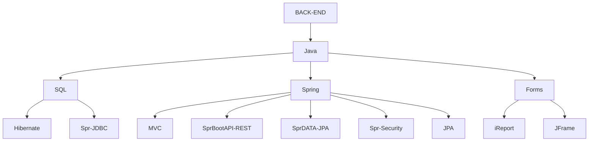

<!--
**rodolfo-jara/rodolfo-jara** is a ✨ _special_ ✨ repository because its `README.md` (this file) appears on your GitHub profile.

Here are some ideas to get you started:

- 🔭 I’m currently working on ...
- 🌱 I’m currently learning ...
- 👯 I’m looking to collaborate on ...
- 🤔 I’m looking for help with ...
- 💬 Ask me about ...
- 📫 How to reach me: ...
- 😄 Pronouns: ...
- ⚡ Fun fact: ...
-->
 
<h3 align="center">Apasionado por el desarrollo de software y recién graduado en Informática y Computación. Con destacada experiencia en el diseño y desarrollo de proyectos académicos utilizando Java Spring Boot y arquitectura de microservicios. Mi enfoque está en resolver problemas creativamente y brindar soluciones eficientes. Busco oportunidades para aplicar y ampliar mis habilidades, contribuyendo al éxito de proyectos innovadores de desarrollo de software.</h3>

  
   
  
  

 

 
 

<h3 align="left">Conocimientos</h3>
<table width="320px">
    <tbody>
        <tr valign="top">
            <td width="100px" align="center">
            <strong>Java</strong> 
            
            </td>
         <td width="120px" align="center">
            <strong>Spring Boot</strong> 
            
            </td>
         <td width="100px" align="center">
            <strong>MYSQL</strong> 
            
            </td>
         <td width="80px" align="center">
            <strong>Sql-Server</strong> 
            
            </td>
         <td width="80px" align="center">
            <strong>Git</strong> 
            
            </td>
            <td width="80px" align="center">
            <strong>AZURE</strong> 
            
            </td>
        </tr>
        <tr valign="top">
         <td width="80px" align="center">
            <strong>Angular</strong> 
            
            </td>
                              <td width="150px" align="center">
            <strong>React Js</strong> 
            
            </td>
                      <td width="80px" align="center">
            <strong>HTML</strong> 
            
            </td>
                     <td width="80px" align="center">
            <strong>CSS</strong> 
            
            </td>
        </tr>
    </tbody>
</table>

- 🔭 Project that I have developed working with Java [Sistema de Calificaciones](https://github.com/Rodolfo-Jara/ProyectoSistemaDeCalificaciones)

- 👨‍💻 My resume is available at [https://rodolfo-jara.github.io/_/Pagina/index.html](https://rodolfo-jara.github.io/_/Pagina/index.html)

- 📫 How to reach me **rjaralopez19@gmail.com**

<h3 align="left">Connect with me:</h3>

<h3 align="left">Languages and Tools:</h3>

            <a href="https://www.w3.org/html/" target="_blank" rel="noreferrer">    </a>           <a href="https://developer.apple.com/swift/" target="_blank" rel="noreferrer">      </a> 

<h3>My GitHub Stats</h3>

 

       

&nbsp;

          

          

